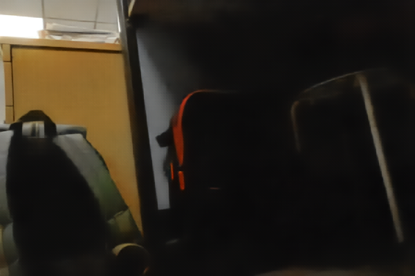
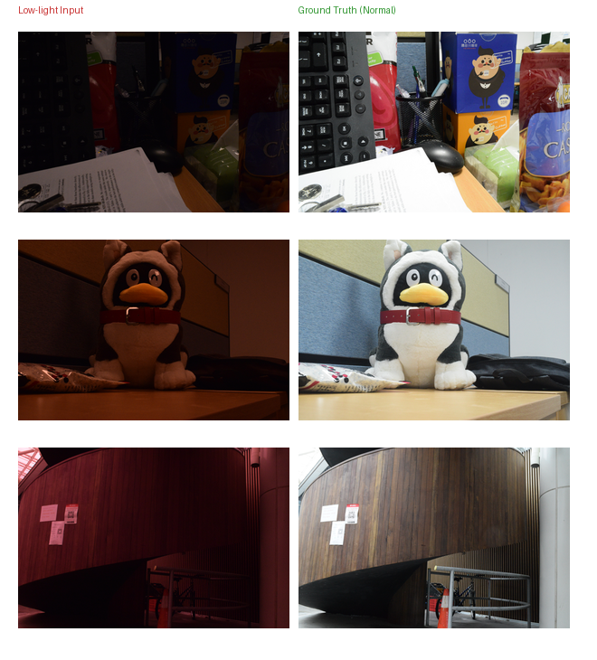

# Low-Light Image Enhancement

A clean, PyTorch-based implementation of the research paper: **"Enhancing Low-light Images Using Infrared Encoded Images"** (ELIEI). 

This repository contains the complete implementation for training, evaluating, and running inference with the ELIEI model.

## Core Features
- **IR-RGB Fusion**: Leverages infrared encoded data to significantly enhance visibly dark scenes.
- **PyTorch backend**: Written and structured clearly using PyTorch.
- **Pre-trained Weights**: Easy-to-use testing script to run inference on your own images.

## Results & Visual Comparisons
Below are a few samples comparing the original low-light input against our model's enhanced prediction. The model successfully recovers color, suppresses noise, and balances exposure.

<p align="center">
  
  
</p>
<p align="center">
  
  
</p>

*Note: The `dataset_samples.png` shows the original ground truth corresponding to one of the test datasets.*

## Repository Structure
```text
├── confs/                  # Configuration files (.yaml, .yml)
├── data/                   # PyTorch dataset definitions (IRRGBDataset)
├── models/                 # Model architecture definitions
├── utils/                  # Helper functions for metrics, logging, etc.
├── train.py                # Main training script
├── test.py                 # Main inference/testing script
├── evaluation_script.py    # Generates visual PSNR/SSIM grids
```

## Usage

### 1. Installation
Clone the repository and install the dependencies:
```bash
git clone https://github.com/Ayman-Singh/LOWLIGHTEN_IMAGE_ENHANCEMENT.git
cd LOWLIGHTEN_IMAGE_ENHANCEMENT
pip install -r requirements.txt
```

### 2. Inference (Testing)
To enhance your own low-light images, you can run the `test.py` script. The model weights should be placed in the `Checkpoints` directory.
```bash
# Run inference on the evaluation dataset
python test.py --config confs/IR-RGB.yaml --checkpoint Checkpoints/120000_G.pt --data_root path/to/eval/folder --output_dir results/
```
*Predictions on the eval dataset are saved to the specified output folder.*

### 3. Training
If you want to train the model from scratch on your own dataset, set up your configuration in `confs/` and run:
```bash
python train.py --config confs/IR-RGB.yaml
```

## Acknowledgments
This repository is an unofficial implementation based on the principles described in the original ELIEI paper.
